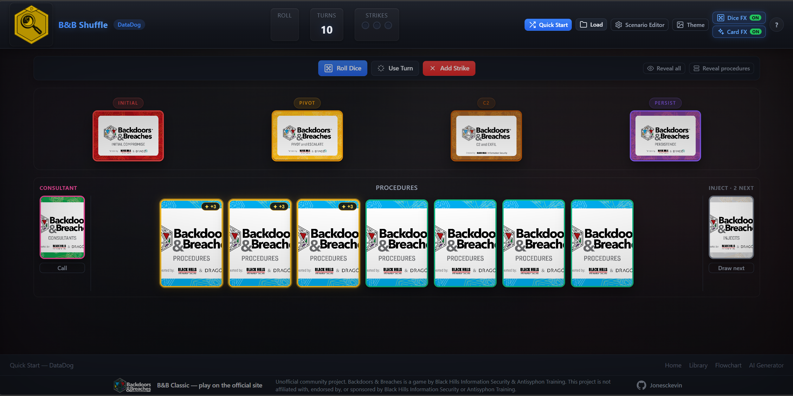

# B&B-Shuffle Engine-V2

Modern, responsive dashboard for conducting [Backdoors & Breaches](https://www.blackhillsinfosec.com/projects/backdoorsandbreaches/) sessions remotely.

Backdoors & Breaches is the property of [Black Hills InfoSec](https://www.blackhillsinfosec.com/). It is a cutting-edge tool for conducting incident response walkthroughs and cybersecurity training seminars.

<table>
  <tr>
    <td></td>
    <td></td>
  </tr>
  <tr>
    <td style="text-align: center;">Player Interface</td>
    <td style="text-align: center;">Admin Interface</td>
  </tr>
</table>

## Primary Features

1. New Look, Feel, and Logic
2. Scenario Builder
3. Scenario Library
4. Card Creator
5. Printable DM/GM Worksheet
6. Background and Logo Changer

## Docker Run Instructions

```bash
# Build and run the container in detached mode, exposing ports 8180 and 8001
docker pull jonesckevin/b-b-shuffle:latest
docker run -d --name bb-shuffle \
  -p 8180:80 \
  -p 8001:8001 \
  -v $(pwd)/data:/usr/share/nginx/html/data \
  jonesckevin/b-b-shuffle:latest
```

## Docker Compose Build and Run Instructions

```bash
git clone https://github.com/jonesckevin/b-b-shuffle
cd b-b-shuffle

docker compose up --build -d
```

---

## Migration from Engine-V1

**Engine-V2** maintains compatibility with Engine-V1 game sessions while offering enhanced features. Both engines are available in this deployment for comparison and transition purposes.

- **Engine-V1** : `http://localhost:8180/Engine-V1/`
- **Engine-V2** : `http://localhost:8180/Engine-V2/`

---

## License & Attribution

This project is licensed under the **GNU General Public License v3.0** — see [`LICENSE`](LICENSE).

This repository is a derivative work of:

- [`p3hndrx/B-B-Shuffle`](https://github.com/p3hndrx/B-B-Shuffle) and
- [`blackhillsinfosec/play.backdoorsandbreaches.com`](https://github.com/blackhillsinfosec/play.backdoorsandbreaches.com)

both released under GPL-3.0. Files derived from those projects retain the GPL-3.0
license and their original copyright notices. `Engine-V2` is a modified/refactored
version of that codebase and is likewise distributed under GPL-3.0. See [`NOTICE`](NOTICE)
and [`THIRD-PARTY-NOTICES.md`](THIRD-PARTY-NOTICES.md) for details.

> **Trademark / content notice:** This is an **unofficial project**. *Backdoors & Breaches* is a game by Black Hills Information Security & Antisyphon Training. This project is **not affiliated with**, Black Hills Information Security or Antisyphon Training. Card artwork, card text, and game design are the property of Black Hills Information Security and their respective sponsors, and are **not** covered by this project's GPL license. A separate content license from the rights holders is required to redistribute those assets.

## Support & Contributions

- For issues, feature requests, or contributions, raise a repo issue. Engine-V2 represents a significant evolution in cybersecurity training tools, combining modern web technologies with proven educational methodologies.
- Dont forget to visit [Black Hills InfoSec](https://www.blackhillsinfosec.com/tools/backdoorsandbreaches/classic)